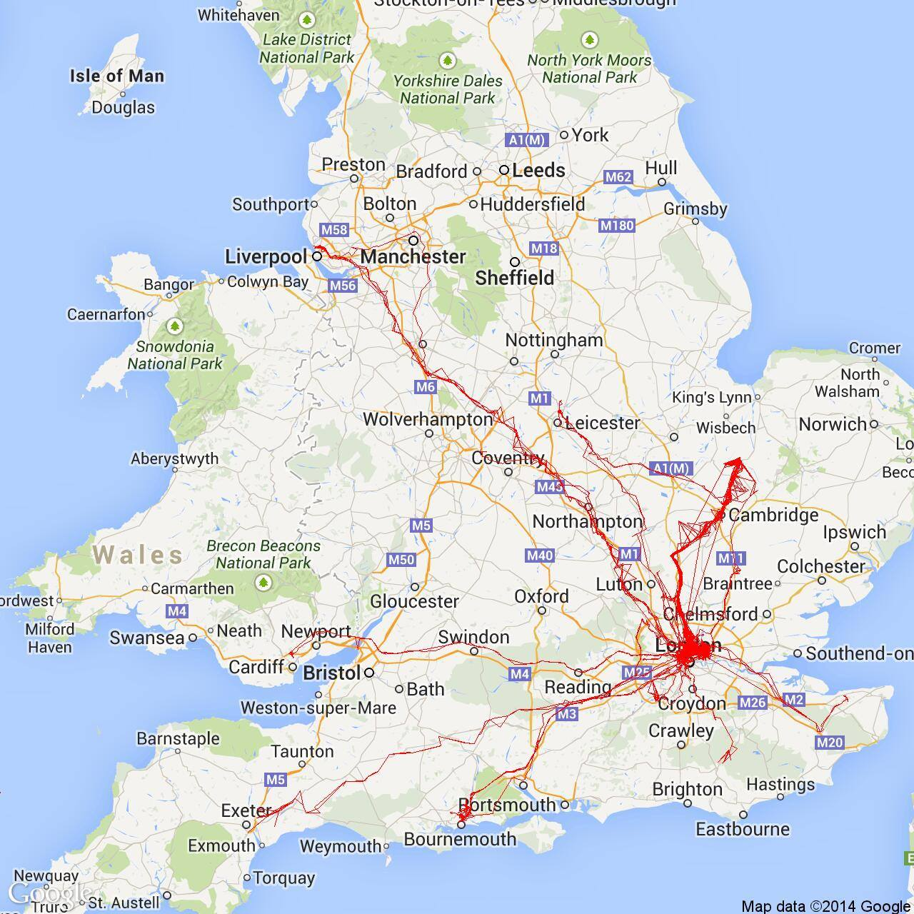

# Latitude-Mapper

Visualise Google latitude location history.

### Technologies

- ASP.NET MVC
- Google Static Maps API

Inspired by [LatitudeHistoryPlotter](https://github.com/snowdonjames/LatitudeHistoryPlotter)
